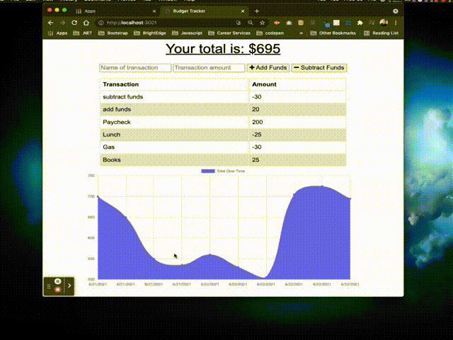

# PWA_BudgetTracker

## Summary

Unit 18 PWA Homework: Online/Offline Budget Trackers:

Budget Tracker is a `Progressive Web Application` that provides added functionality for offline access.  The user is able to add expenses and deposits to their budget with or without a connection. 

When entering transactions offline, they populate the total when brought back online. In addition, `indexedDB` was used to cache dynamic content, i.e. users' inputs for withdrawals or deposits.

Application deployed with `Heroku and MongoDB Atlas.`: [PWA Budget Tracker](https://pwa-budget-trakker.herokuapp.com/)
]

PWA Budget Tracker App

## Table of Contents
* [User Story](#user-story)
* [Business Context](#business-context)
* [Mock Up](#mock-up)
* [Installation](#installation)
* [Usage](#usage)
* [Features](#features)
* [Acceptance #Citeria](#)
* [Resources](#resources)
* [Submitted For Review](#submitted-for-review)
* [Questions](#questions)
* [License](#license)

## User Story
```
AS AN avid traveller
I WANT to be able to track my withdrawals and deposits with or without a data/internet connection
SO THAT my account balance is accurate when I am traveling

```

## Business Context

Giving users a fast and easy way to track their money is important, but allowing them to access that information anytime is even more important. Having offline functionality is paramount to our applications success.


## Mock Up

The following video demostrates the functionaloty of the application:




## Installation

Node.Js must be installed to run this application.

You'll need to set up a MongoDB Atlas account and connect a database to your application. 

Before you begin, make sure to install all of the necessary dependencies with `npm install`.

`npm i mongoose` , `npm i express` ,`npm i compressions` ,`npm i morgan`

Create a `service-worker.js` file in the `public` directory.

More information on creating a `service worker` and deploying a`manifest` is available in the [Resources](#resources) section below.


## Usage

In a new terminal window run `npm install`

Run `node server` or `npm start` to establish a connection with `Mongo mongodb server.

Use`http://localhost:3000/` to run this application in your browser.

Refer back to the [Resources](#resources) section to help you accomplish the following steps.

Link the app manifest to the website - the `manifest.webamanifest` file has been created for you.

Install the `service worker` to cache static assets - the service worker has been registered for you.

Retrieve cached files for an offline experience.

Download the PWA.

For more information on deploying with MongoDB Atlas and Heroku, please visit the [Resources](#resources) section.

For testing, please visit the deployed application on Heroku: [Budget Tracker App](/)

# Features


The Features of this application are described in the next section and listed as part of the acceptance criteria for this assignment.

Offline Functionality:

  * Enter deposits offline

  * Enter expenses offline

   When brought back online:

  * Offline entries are added to tracker.


## Acceptance Criteria
```
GIVEN a user is on Budget App without an internet connection
WHEN the user inputs a withdrawal or deposit
THEN that will be shown on the page, and added to their transaction history when their connection is back online.
```

## Resources

* [Your First Progressive Web App](https://developers.google.com/web/fundamentals/codelabs/your-first-pwapp/)
* [Progressive Web App](https://web.dev/progressive-web-apps/) applications that have been designed so they are capable, reliable, and installable. 
* [indexedDB](https://developer.mozilla.org/en-US/docs/Web/API/IndexedDB_API) Low level-API for client-side storage of significant amounts of structured data. 
* [PWAs with Webpack][public/assets/pwaWebpack.md]

* [MDN Progressive Loading](https://developer.mozilla.org/en-US/docs/Web/Progressive_web_apps/Loading)
* [NodeJS](https://nodejs.org/en/) open-source, cross-platform, back-end JavaScript runtime environment.
* [Mongoose](https://www.npmjs.com/package/mongoose) a MongoDB object modeling tool designed to work in an asynchronous environment. Mongoose supports both promises and callbacks.
* [Express](https://www.npmjs.com/package/express) a node.js web application framework known as middleware for API creation.
* [Morgan](https://www.npmjs.com/package/morgan) HTTP request logger middleware for node.js
* [lite-server](https://www.npmjs.com/package/lite-server) Lightweight development only node server that serves a web app,
* [compression](https://www.npmjs.com/package/compression) Returns the compression middleware using the given options.
* [webpack-pwa-manifest documentation](https://github.com/arthurbergmz/webpack-pwa-manifest)

* [Web App Manifest - Deploying a manifest](https://developer.mozilla.org/en-US/docs/Web/Manifest#Deploying_a_manifest_with_the_link_tag).
* [Webpack PWA Manifest](https://www.npmjs.com/package/webpack-pwa-manifest)
*  [MDN Web App Manifest documentation](https://developer.mozilla.org/en-US/docs/Web/Manifest) 
* [Heroku](https://www.heroku.com/) cloud-application platform/
* [MongoDB](https://www.mongodb.com/cloud/atlas/) NoSQL document database composed of field and value pairs.
* [Audit the Performance of Your Web Application](https://developers.google.com/web/fundamentals/performance/audit/)
* [Google Lighthouse](https://developers.google.com/web/tools/lighthouse/)
## Submitted For Review

  * the URL to the deployed application

  * the URL to the Github repository

## Questions

[GitHub Profile](https://github.com/rdevans87)


## License

[MIT LICENSE](LICENSE)